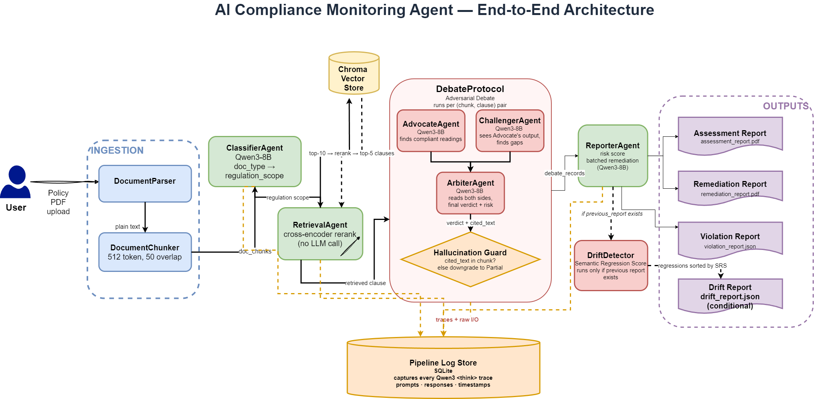

# Agentic AI Compliance Monitoring System

An AI-powered compliance audit platform that evaluates enterprise documents - privacy policies, security SOPs, vendor agreements, breach-response procedures - against **GDPR**, **HIPAA**, and **NIST SP 800-53**. The system produces audit-ready POA&M (Plan of Action and Milestones) reports, the same format used by real enterprise compliance teams, and continuously monitors for compliance drift as both regulations and internal documents evolve.

Every model runs locally. Zero marginal cost per audit. Full reasoning traces captured for every verdict.

---

## What makes it different

**1. Adversarial debate evaluation.** Rather than a single LLM deciding compliance, three specialized agents argue every clause - an **Advocate** that finds every reading of the policy that satisfies the requirement, a **Challenger** that reads the Advocate's argument and surfaces every gap, and an **Arbiter** that weighs both sides and issues the final verdict. Grounded in Du et al. (2023), *Improving Factuality via Multi-Agent Debate*.

**2. Local open-weight LLM with visible thinking traces.** All debate agents run on `Qwen/Qwen3-8B` locally. Qwen3 produces `<think>…</think>` reasoning tokens before every answer; every trace is captured in the pipeline log store, making the system fully auditable and reproducible. A unique ablation - thinking ON vs OFF - becomes possible.

**3. Regulation-aware continuous update via Adaptive RAG Refresh.** A scheduled `RegulationWatcher` polls official sources (EUR-Lex for GDPR, eCFR for HIPAA, NIST CPRT for SP 800-53), computes a semantic diff between old and new article embeddings, and re-indexes only the articles whose cosine distance exceeds the update threshold. Documents previously evaluated against changed articles are flagged for re-evaluation.

**4. Compliance drift with Semantic Regression Score (SRS).** Compares two versions of the same document and computes a continuous regression score - `SRS = coverage_rank_drop × risk_weight × (1 + cosine_distance(cited_v1, cited_v2))`. A clause removal scores ~4.0; a subtle language weakening scores ~1.5. This prioritizes remediation effort by severity rather than count.

---

## Architecture



The pipeline is implemented as a LangGraph `StateGraph` - Classifier → Retrieval → Debate → Reporter, with an optional Drift node running before PDF rendering when a previous report is supplied. Full step-by-step walkthrough in [`architecture.md`](./architecture.md).

---

## Capabilities

| Area | Details |
|---|---|
| Supported regulations | GDPR (10 focus articles), HIPAA (144 CFR sections), NIST SP 800-53 (324 controls) |
| Document formats | PDF, DOCX, TXT |
| Regulation routing | Classifier maps each document to the regulations that actually apply; exclusion matrix prevents contradictory combinations (GDPR + HIPAA) |
| Retrieval | Two-stage - Chroma ANN over `all-MiniLM-L6-v2` embeddings, then cross-encoder reranking via `ms-marco-MiniLM-L-6-v2` |
| Debate | Three sequential Qwen3-8B calls per (chunk, article) pair, with a cite-then-verify hallucination guard |
| Reporting | Jinja2 templates rendered to Markdown, then PDF via xhtml2pdf - Assessment Report and Remediation Report |
| Drift detection | Semantic Regression Score surfaces weakened clauses between document versions |
| Auditability | Every prompt, thinking trace, and structured response is written to `outputs/pipeline_logs.db` |

---

## User Interface

*Screenshots of the application UI will be added here once the frontend is deployed.*

| View | Purpose |
|---|---|
| _Upload & Analysis_ | Upload a policy document, choose regulation scope override if needed, and start an audit run. Progress is surfaced while the Qwen3-8B debate pipeline executes. |
| _Assessment Dashboard_ | Risk score (0.0–4.0), risk level, per-article verdict table (Full / Partial / Missing), hallucination-flag indicator, and inline citations from the source document. |
| _Remediation Report_ | Prioritized action list - each item includes the gap identified by the Challenger agent, the exact policy language to add, and the source regulation reference. |
| _Drift View_ | Side-by-side diff between two versions of the same document, ranked by Semantic Regression Score. |
| _Debate Transcript_ | Full Advocate / Challenger / Arbiter transcripts with Qwen `<think>` traces for any article - the audit-trail view. |
| _Regulation Registry_ | Active regulations, their focus articles, and the most recent update detected by the RegulationWatcher. |

---

## Quick start

```bash
python -m venv venv && source venv/bin/activate
pip install -r requirements.txt
cp .env.example .env             # set QWEN_MODEL_ID and AGENTIC_AUDIT_CORS_ORIGINS

# Build regulation indexes (run once; safe to re-run)
python scripts/index_regulations.py --regulation gdpr
python scripts/index_regulations.py --regulation hipaa
python scripts/index_regulations.py --regulation nist

# CLI - run the full pipeline on a single document
python run_pipeline.py --doc test_datasets/gdpr/articles/gdpr_compliant_streamvibe.pdf

# Ablation - disable Qwen <think> reasoning (C4-nothink condition)
python run_pipeline.py --doc <file> --no-thinking

# Drift - compare against a previous audit run
python run_pipeline.py --doc <file> \
    --previous-report outputs/reports/<doc_id>/raw/violation_report.json

# API - start the FastAPI server that backs the frontend
uvicorn backend.api.main:app --reload --port 8000
```

---

## API

All endpoints are versioned under `/api/v1/`. The full request/response contract lives in `spec.md` Section 19.

| Method | Path | Purpose |
|---|---|---|
| `GET` | `/health` | Liveness check and list of active regulations |
| `GET` | `/regulations` | Active regulation namespaces with their focus articles |
| `POST` | `/analyze` | Upload a document and run the full compliance pipeline (multipart/form-data; optional `?thinking=false`) |
| `GET` | `/reports` | List every completed analysis run |
| `GET` | `/reports/{doc_id}` | Full `ViolationReport` JSON for one run |
| `GET` | `/reports/{doc_id}/assessment` | Download the Assessment PDF |
| `GET` | `/reports/{doc_id}/remediation` | Download the Remediation PDF |

CORS is configurable through the `AGENTIC_AUDIT_CORS_ORIGINS` environment variable (comma-separated origin list; defaults to the common local frontend ports).

---

## Repository layout

```
Agentic_Audit/
├── backend/                 All Python logic
│   ├── api/                 FastAPI layer (main.py, routes.py)
│   ├── agents/              Classifier, Retrieval, Debate, Reporter + ComplianceState
│   ├── debate/              Advocate / Challenger / Arbiter protocol + Qwen singleton
│   ├── retrieval/           Embedder, Chroma wrapper, cross-encoder reranker
│   ├── reports/             Jinja2 templates and Markdown-to-PDF renderer
│   ├── drift/               Semantic Regression Score detector
│   ├── regulation/          RegulationWatcher, differ, changelog
│   ├── ingestion/           PDF/DOCX/TXT parsing + chunking
│   ├── logging/             Pipeline log writer (SQLite + JSON sidecar)
│   └── graph.py             LangGraph StateGraph + run_pipeline()
├── frontend/                Reserved for the React/Next.js UI
├── data/
│   ├── compliance/          Regulation source data (GDPR, HIPAA, NIST, SOC 2, ISO 27001 placeholders)
│   └── chroma_db/           Persistent vector store (auto-generated)
├── test_datasets/           Evaluation documents + ground-truth annotation PDFs
├── outputs/
│   ├── reports/{doc_id}/    Per-run POA&M PDFs and raw violation_report.json
│   ├── POA&M/               Evaluation harness outputs + EVALUATION_TABLES.{md,pdf}
│   └── pipeline_logs.db     Aggregated SQLite log of every run
├── scripts/                 Indexing, evaluation, and report-generation utilities
├── spec.md                  Engineering specification - single source of truth
├── architecture.md          High-level walkthrough of the pipeline
├── run_pipeline.py          CLI entry point for the pipeline
└── run_evaluation.py        Legacy evaluation harness (5 conditions)
```

---

## Evaluation

The evaluation pipeline runs in two layers: a scripted harness that executes the full debate pipeline across `test_datasets/`, and a deterministic **semantic-similarity judge** (`scripts/evaluate_semantic.py`) that scores results against ground truth without depending on the production debate verdict. Results for the six-document test set (three GDPR + three HIPAA) are summarized in `outputs/POA&M/EVALUATION_TABLES.pdf`.

Headline numbers across n=60 article evaluations:

| Category | Metric | Value | Target |
|---|---|---|---|
| Retrieval Quality | RAGAS Faithfulness | 1.000 | ≥ 0.85 |
| Retrieval Quality | Answer Relevance | 0.950 | ≥ 0.80 |
| Retrieval Quality | Context Precision | 0.883 | ≥ 0.75 |
| Report Quality | Likert score (1–4) | 4.00 | - |
| Report Quality | Hallucination rate | 0.000 | lower is better |

Clause-level verdict accuracy is reported as macro-averaged Precision, Recall, and Cohen's Kappa across the three verdict classes (Full / Partial / Missing); see `spec.md` Section 14 for why these values are class-imbalance bound.

Regenerate every artifact:

```bash
python scripts/batch_evaluate.py
python scripts/compute_full_metrics.py
python scripts/enrich_metrics.py
python scripts/evaluate_semantic.py
python scripts/generate_tables.py
```

---

## Technology stack

| Layer | Stack |
|---|---|
| Orchestration | LangGraph `StateGraph` over a typed `ComplianceState` |
| LLM | `Qwen/Qwen3-8B` (classifier, debate agents, remediation) - local, deterministic decoding |
| Embeddings | `sentence-transformers/all-MiniLM-L6-v2` |
| Reranker | `cross-encoder/ms-marco-MiniLM-L-6-v2` |
| Vector store | ChromaDB (one collection per regulation namespace) |
| API | FastAPI + Uvicorn with CORS middleware |
| Report rendering | Jinja2 → Markdown → xhtml2pdf |
| Logging | SQLite (`outputs/pipeline_logs.db`) + per-run JSON sidecar |
| Document parsing | PyMuPDF (PDF), python-docx (DOCX), tiktoken for chunking |

---

## Documentation

- [`spec.md`](./spec.md) - Engineering specification. Every schema, prompt, data contract, and runbook.
- [`architecture.md`](./architecture.md) - Step-by-step system walkthrough with diagrams.
- [`spec.md` Section 19](./spec.md) - Frontend integration and full API contract.
- [`spec.md` Section 20](./spec.md) - Teammate handoff runbook (local bring-up, code touch-points, open items).
